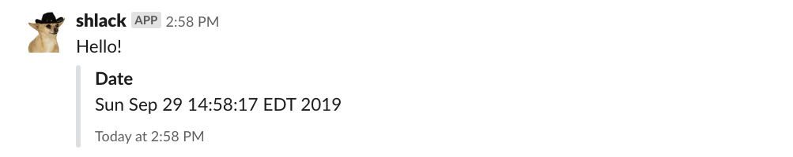
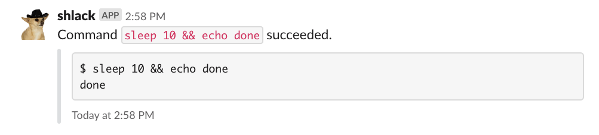
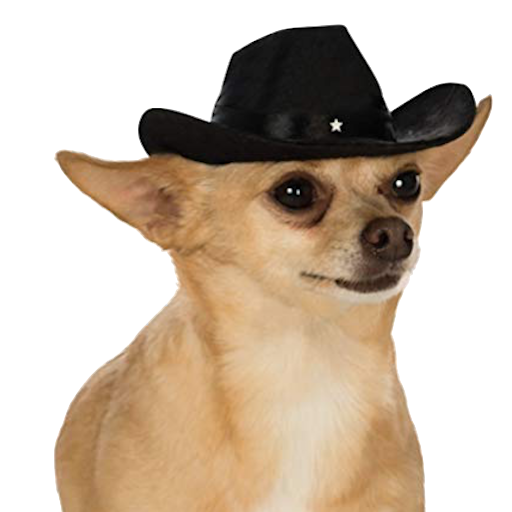

# shlack

[](https://github.com/nolanbconaway/shlack/actions)
[](https://codecov.io/gh/nolanbconaway/shlack)

`shlack` is a command line tool which sends slack messages. It is a lot like [jarjar](https://github.com/AusterweilLab/jarjar) but with [a few (important?) differences](shlack-and-jarjar.md).

## Quickstart

First, [set up a slack app](#setting-up-a-slack-app) for shlack and have the oauth API token handy.

Then install shlack to your python 2.7, 3.5, 3.6, or 3.7 environment:

``` sh
pip install git+https://github.com/nolanbconaway/shlack.git
```

Export your slack oauth token:

``` sh
$ export SLACK_OAUTH_API_TOKEN='...'
```

Now send yourself a message! shlack will read your token from the variable you exported.

``` sh
$ shlack message 'Hello!' --channel '@nolan'
```

In your slack workspace:

<p align="center">
  
</p>

Add an attachment:

``` sh
$ shlack message 'Hello!' -c '@nolan' --attach 'Date' "$(date)"
```

<p align="center">
  
</p>

shlack can also send you a notification after a long-running task has completed.

``` sh
$ shlack task 'sleep 10 && echo done' --channel '@nolan'
```

<p align="center">
  
</p>

Running that will spin up a process detached from your terminal session, so you can  grab some lunch :-).

Need help? Just ask:

``` sh
$ shlack task --help
```

## Setting up a Slack App

Start by heading over to the [apps page](https://api.slack.com/apps) and hit the "create new app" button.

Name your app whatever you want (I called mine, `shlack` ) and assign it to your workspace of choice if you have multiple workspaces. Then hit "create app".

Slack should take you to an app management page. Hit the "Permissions" button (or the "OAuth & Permissions" tab on the sidebar).

Scroll down to the "Scopes" section. Add the following two scopes:

1. `chat:write:bot` . Shlack needs this to post messages.
2. `files:write:user` . Shlack does not use this scope at present, but one day will upload the output of more verbose tasks as files rather than as messages.

Hit the "Save Changes" button once those two scopes are selected. Then scroll to the top of the page and hit the "Install App to Workspace" button. Slack will ask you to allow the app to access the scopes you set up.

The page will refresh and at the top you'll find a new OAuth Access Token. Copy that and put it somewhere for later.

Now you can style the app as you see fit :). Hit the "Basic Information" tab at the top of the sidebar and scroll down to the "Display Information" section. Style to your liking. I use this photo which I found by searching "dog with cowboy hat" on the internet.

<p align="center">
  <a href='img/hero.png'></a>
</p>

Then you're done! Enjoy your shlack app.

## Todo

* [ ] Write some tooling to help users through errors when their display names are not the same as their usernames. Maybe a command to search users. Maybe just some documentation.
* [ ] Surface child PID to user in `shlack task` .
* [ ] get URLs in attachments to unfurl.
* [ ] migrate to blocks https://api.slack.com/messaging/attachments-to-blocks

